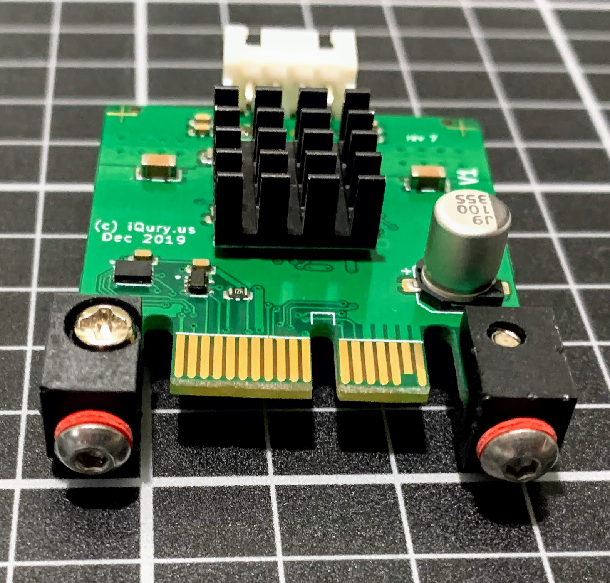
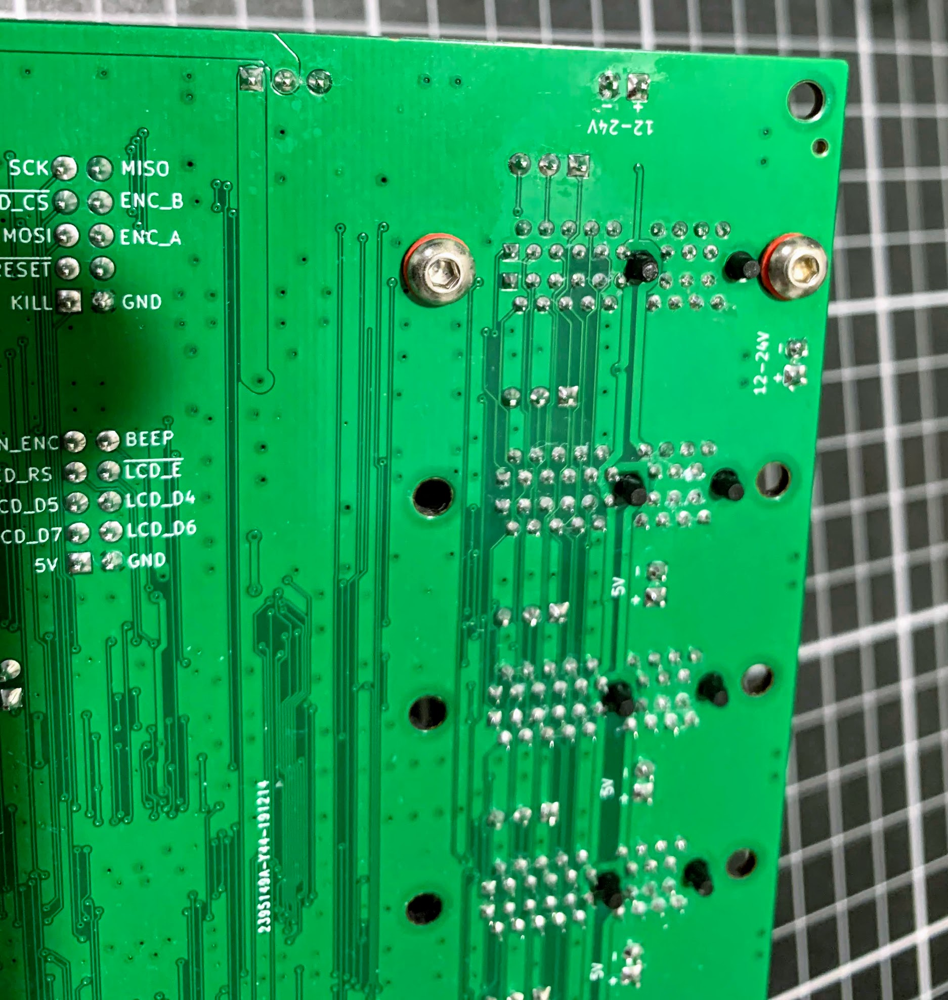
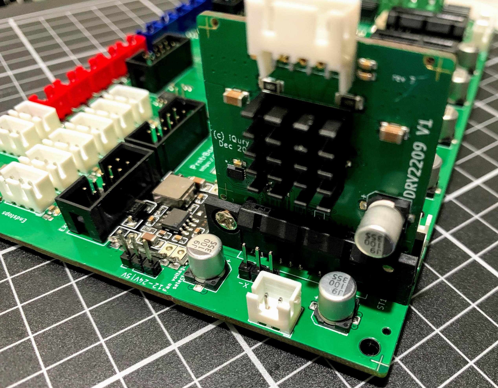

# Instructions how to mount the driver boards

materials needed (per driver board):
* M3 button head screw 5mm - 4pcs
* M3 square flat nut - 2pcs
* M3 insulating washer - 2pcs - nylon of fyber
* DriverMount 3D printed - 2pcs
* Front heat sink - 14x14x8mm or 14x14x6mm or 14x14x7mm.
* Back heat sink - 25x25x5mm

Mount the heat sinks to the board. Make sure the back heat sink is centered and does not short the motor connector pins. The front heat sink should also be somewhat centered on the chip. The fins on the front and back heat sink should be horizontal, not vertical.

Attach the mount feet to the driver board on both sides using M3 screws - not not tighten completely the feet should be able to rotate with minimal force. The mount holes on the driver board are smaller so the screw would be a tight fit and there is no need for a nut. Make sure the hole for the square nut is on the outside of the driver board, not facing the PCIe slot.

Insert the square M3 nuts in the opening on the bottom of each mount foot.

Insert the driver into the PCIe slot on the board. Attach the driver with 2 M3 screws on the bottom of the board and use the insulating washers to prevent the screw from damaging the board.

Repeat for the other driver boards

