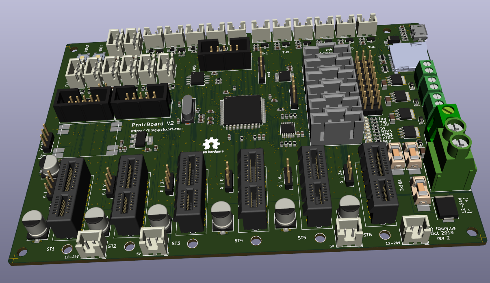
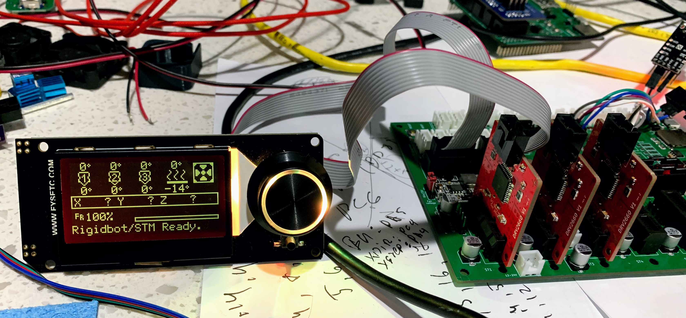
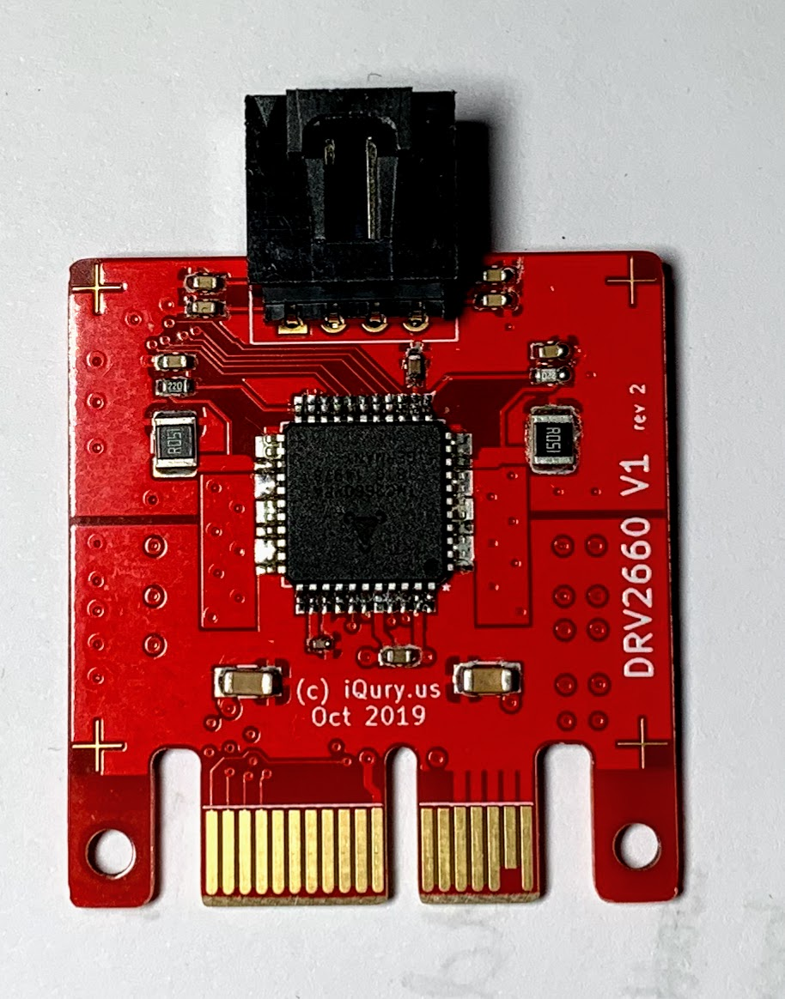
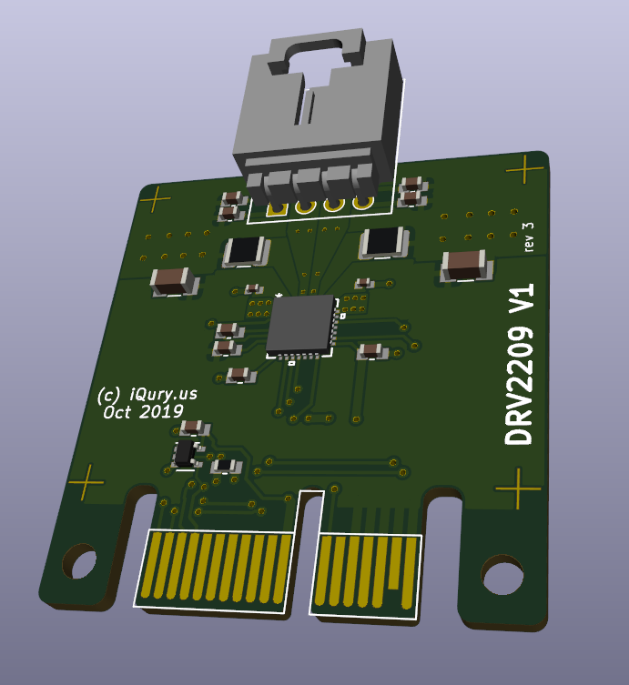
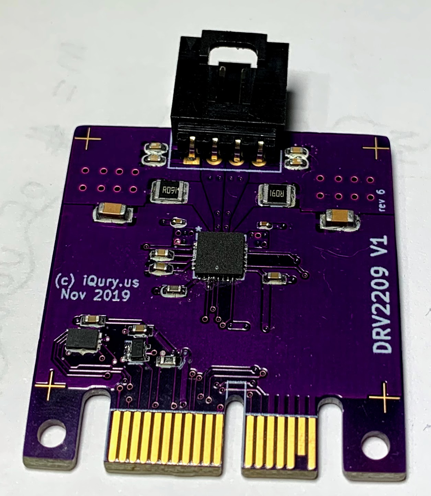
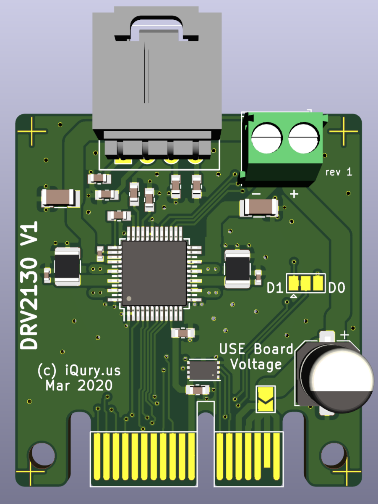

PrntrBoard V2
======================
PrntrBoard V2 is the next iteration of my 3D printer controller design. The V1 was very good, except it had one major drawback - the stepper drivers were soldered on the board which would make the design expensive.
This V2 design has 6 replaceable motor drivers. While traditional RAMPS based boards use pin headers to house the driver boards, I'm using PCIe 1x slots. This design has several advantages:
  + the driver PCB layout can be more flexible as there are fewer constraints on the driver board dimensions
  + drivers are placed vertically on the board which allows for more efficient space utilization as well as more efficient cooling
  + PCIe 1x slots have 36 pins which allows for greater design flexibility

Project Status
-----
The following functionality has been verified on the rev1 prototype board with Marlin firmware:
  + TMC2660 and TMC2209 drivers working and able to move motors
  + Endstops
  + Heaters and thermistor inputs
  + LCD interface with 12864 panel from FYSETC and REPRAP Discount Graphics Panel.
  + Micro SD-card interface
  + EEPROM
  + Fan control

Features of the board:
-----
  + up to 6x replaceable stepper motor drivers
  + 32-bit Arm processor with floating point support running at 168MHz (STM32F407)
  + up to 6 thermistors or 6 thermocouples for temperature control
  + 4 power heaters (1 bed and up to 3 extruder heaters) with PWM power control
  + 5 low power PWM connectors with selectable voltage (5V vs 12-24V) for fans or LEDs
  + 8 end stops with option to use stall detection from the stepper drivers on 6 of them
  + micro-sd card support with SDIO for fast file transfer
  + 2 extra serial ports for WiFi and or smart LCD screen control
  + RAMPS LCD screen support
  + Marlin 2.0 firmware or Smoothieware V1.0, RRF port in progress, Klipper port in progress.
  + 4 extra fan connectors (2x5V and 2x12-24V)
  + Input voltage: 12-24V
  + CAN bus connector contributed by ArkadiuszRaj.

Drivers
------
High power driver using Trinamic TMC2660. Should support up to 2.5A RMS current per phase with forced cooling. Supports stall detection. Driver current is adjustable via SPI.

 

Versatile "economy" driver using Trinamic TMC2209. Should support up to 1.8A RMS current per phase with forced cooling. Supports stall detection. Driver current is adjustable via UART.

High voltage driver (up to 42V) using Trinamic TMC2130. Should support up to 1.1A RMS current per phase with forced cooling. Supports stall detection. Driver current is adjustable via SPI. The driver board has separate power terminal.

Very high current driver design using TMC5161 and TMC2160 with external MOSFETS are also possible. In addition an adapter board for Pololu style stepper drivers is planned for backwards compatibility with old drivers.

Software
------

Marlin v2 is working on the board. I also plan to offer Smoothieware V1 and Klipper support.

Visit [my blog](https://blog.pcbxprt.com/) for status updates on the development of the board.
